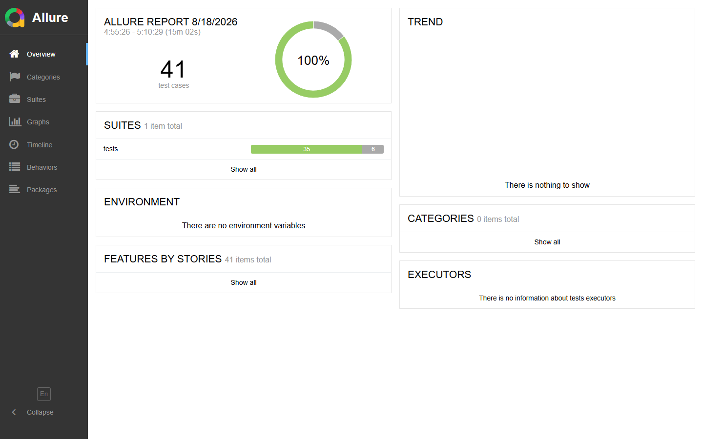

# Selenium PO Pytest 项目

基于 Python + Selenium + Page Object + Pytest 的自动化测试项目。

## 技术栈

- Python 3.11
- Selenium 4
- Pytest 7
- Allure Report
- Faker（随机注册数据）
- openpyxl（Excel 用例文件）
- Jenkins（每日定时回归）
- GitHub Actions（PR/推送 CI）

## 目录结构

```text
Po/
├─ config/          # 项目配置
├─ pages/           # 页面对象
├─ utils/           # 工具类
├─ tests/           # pytest 测试
├─ scripts/         # 脚本
├─ data/            # 测试数据
├─ ai-testing/      # AI Skills 与 Prompt 示例
├─ docs/            # README 文档图片
├─ logs/            # 日志
├─ reports/         # 测试报告
├─ screenshots/     # 失败截图
├─ allure-results/  # Allure 结果
├─ Jenkinsfile      # Jenkins 每日定时回归
└─ .github/         # GitHub Actions CI
```

## AI 测试用例生成

AI 辅助生成测试用例的 Skill 说明和 Prompt 示例放在 `ai-testing/` 目录：

- 基础用例编写：`ai-testing/skills/test-case-writing.md`
- 增强版用例编写：`ai-testing/skills/testcase-writer-plus.md`
- 注册/登录 Prompt 示例：`ai-testing/prompts/generate-register-login-cases.md`

生成测试用例时，默认同时输出 CSV 和 XLSX，两套文件使用相同表头，并在“设计方法”列标注等价类划分、边界值分析、判定表、状态迁移、错误猜测、场景法。

AI 已按 `ai-testing/skills/core-business-testing.md` 完成核心业务自动化闭环，核心业务 Prompt 见 `ai-testing/prompts/generate-core-business-cases.md`。

## 当前测试用例

当前已纳入仓库的交付用例：

- 注册测试用例：`注册测试用例_最终.csv`、`注册测试用例_最终.xlsx`
- 登录测试用例：`登录测试用例_最终.csv`、`登录测试用例_最终.xlsx`

自动化执行使用的数据驱动源文件仍位于：

- 登录：`data/cases/login_cases.csv`、`data/cases/login_cases.xlsx`
- 注册：`data/cases/register_cases.csv`、`data/cases/register_cases.xlsx`

## 核心业务测试范围

核心业务定义为两条主链路：

1. 预约：服务选择、日期时间步骤、预约确认。
2. 商城成交：商品搜索、商品详情、加购、会员结算门禁。

登录/注册属于支撑链路，已有独立用例，不重复扩张。咨询表单功能已从核心范围移除。

当前核心业务用例文件：

- `核心业务测试用例_最终.csv`
- `核心业务测试用例_最终.xlsx`

## 量化结果

- 注册用例：8 条
- 登录用例：10 条
- 预约用例：15 条
- 支付用例：12 条
- 商城搜索/详情/购物车/结算：5 条
- 核心业务用例资产合计：32 条
- 稳定核心自动化子集：7 条通过，约 4 分 25 秒
- Jenkins 定时回归：每天 12:00，`cron('0 12 * * *')`

> 真实预约提交、结算页取消、重复预约、支付成功/失败受测试环境限制，默认跳过或条件执行，不写为“全量通过”。

测试用例样例：

```text
用例编号,用例名称,模块,测试类型,设计方法,优先级,前置条件,测试数据,测试步骤,预期结果,需求追踪,执行状态,备注
CORE-BOOK-002,选择服务后进入日期时间步骤,预约,功能测试,场景法,P0,已打开免费咨询预约页,选择第一个服务,1. 选择服务；2. 点击 Next；3. 校验日期时间步骤,页面显示 Day and time 和确认入口,预约流程,已自动化,AI 赋能生成
```

执行核心业务测试：

```bash
python -m pytest -m core
```

执行稳定核心回归：

```bash
python -m pytest -m core_stable
```

只跑某个模块：

```bash
python -m pytest -m store
python -m pytest -m booking
python -m pytest -m payment
```

重新生成核心业务用例交付文件：

```bash
python -m scripts.generate_core_business_cases
```

## Jenkins 定时回归

`Jenkinsfile` 已配置每日自动回归一次：

- 触发频率：每天 `12:00`，即 `cron('0 12 * * *')`
- 执行步骤：创建/复用 `.venv`、安装依赖、语法检查、运行 pytest、生成 Allure 报告
- 产物归档：`reports/`、`logs/`、`screenshots/`、`allure-results/`
- 报告发布：HTML Test Report 和 Allure Report
- 邮件通知：发送到 `3026288915@qq.com`

Jenkins 定时任务默认运行 `core_stable` 稳定核心回归，避免环境受限用例影响定时任务稳定性：

```bash
.venv\Scripts\python.exe -m pytest -m core_stable --junitxml=reports\junit.xml --alluredir=allure-results --clean-alluredir
```

如需完整核心回归，可手动执行 `python -m pytest -m core`。

## GitHub Actions CI

`.github/workflows/ci.yml` 会在 push / pull request 时：

1. 安装 Python、Chrome 和 Chromedriver
2. 安装 `requirements.txt`
3. 编译 Python 源码
4. 执行浏览器测试
5. 生成并上传 Allure 报告和测试产物

## 环境准备

```bash
pip install -r requirements.txt
```

默认使用 Chrome 运行；如需 Firefox 兼容性测试，请先安装 Firefox。geckodriver 未配置时，`webdriver-manager` 会自动下载。

## 运行测试

```bash
python -m pytest
```

`pytest.ini` 已配置生成 HTML 报告，运行后会输出到 `reports/report.html`。

## 数据驱动

测试数据存放在外部文件中，测试运行时会读取文件后参数化：

- 登录用例：`data/cases/login_cases.csv`
- 注册用例：`data/cases/register_cases.xlsx`，同目录下也有 CSV 版本
- 新增或修改用例时直接编辑对应文件，不需要修改测试函数
- 如果编辑了 CSV，可执行 `python -m scripts.generate_case_files` 重新生成 Excel 版本
- 可用环境变量 `LOGIN_CASES_FILE`、`REGISTER_CASES_FILE` 指定其他 CSV/Excel 数据文件
- 默认 `auto`：有文件时用文件，文件不存在时退回代码里的用例数据
- 强制只用文件：`python -m pytest --data-source file`
- 强制只用代码：`python -m pytest --data-source code`
- 也可以用环境变量 `TEST_DATA_SOURCE=code` 或 `TEST_DATA_SOURCE=file`

## 选择浏览器

```bash
# Chrome（默认）
python -m pytest

# Firefox 兼容性测试
python -m pytest --browser firefox
```

也可以设置环境变量 `BROWSER=firefox`。如需指定驱动或浏览器程序路径，可设置 `FIREFOX_DRIVER_PATH`、`FIREFOX_BINARY_PATH`。

## 注册功能测试

```bash
# 只跑注册用例，默认 Chrome
python -m pytest -m register

# Firefox 兼容性注册测试
python -m pytest -m register --browser firefox

# 一键运行注册用例
python -m scripts.run_tests -m register --browser firefox
```

注册邮箱和手机号每次执行时由 Faker 随机生成。手机号默认选择中国区号 `cn`，可设置 `REGISTER_MOBILE_COUNTRY=hk` 切换为香港区号。

## 按标记运行

```bash
# 只运行登录用例
python -m pytest -m login

# 只运行冒烟用例
python -m pytest -m smoke
```

## 一键运行并生成报告

```bash
python -m scripts.run_tests
```

Firefox 兼容性测试也可通过一键脚本运行：

```bash
python -m scripts.run_tests --browser firefox
```

该脚本会：

1. 运行全部 pytest 用例。
2. 自动生成 HTML 报告到 `reports/report.html`。
3. 如果安装了 `allure-pytest`，生成 Allure 结果到 `allure-results/`。
4. 如果同时安装了 Allure CLI，生成 Allure 报告到 `reports/allure-report/`。

## 手动生成 Allure 报告

```bash
python -m pytest --alluredir=allure-results
allure generate allure-results -o reports/allure-report --clean
```

## Allure 报告

本地生成后入口：`reports/allure-report/index.html`

README 中的 Allure 截图：



> 当前截图来自稳定核心回归子集：商城 3 条、预约 2 条、支付 2 条，共 7 条通过。
> 站点不稳定/环境受限的预约提交、结算页取消、重复预约、支付成功/失败默认跳过或条件执行。
> 完整 Allure 结果以 `reports/allure-report/index.html` 为准。
